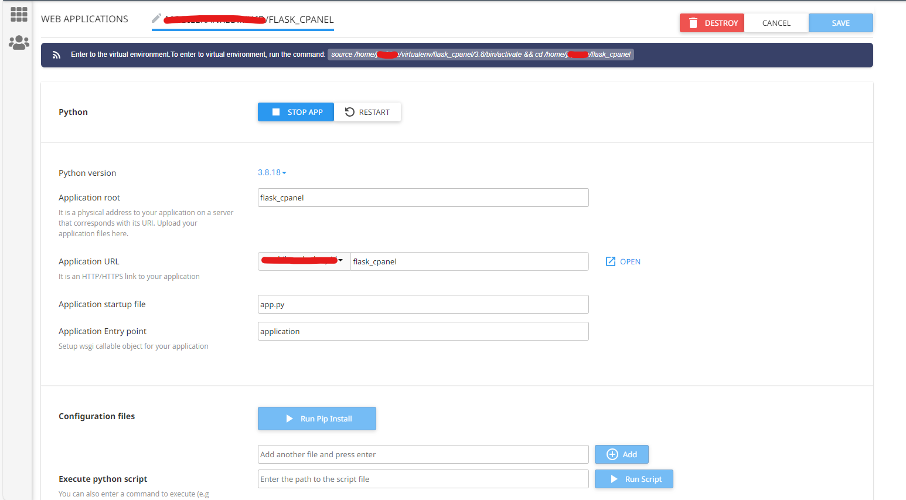

# FLASK CPANEL

## Guide Deploy Cpanel

1. Login your cpanel.
2. Access menu **Setup Python App**.
   
3. Click **Create Application** to new deploy.
   
4. Setting configuration deploy,then click **create**.
   Below is an example of a simple configuration.
   
   
5. Automatic create folder **flask_cpanel**, then can access https://domain/flask_cpanel
   

   
